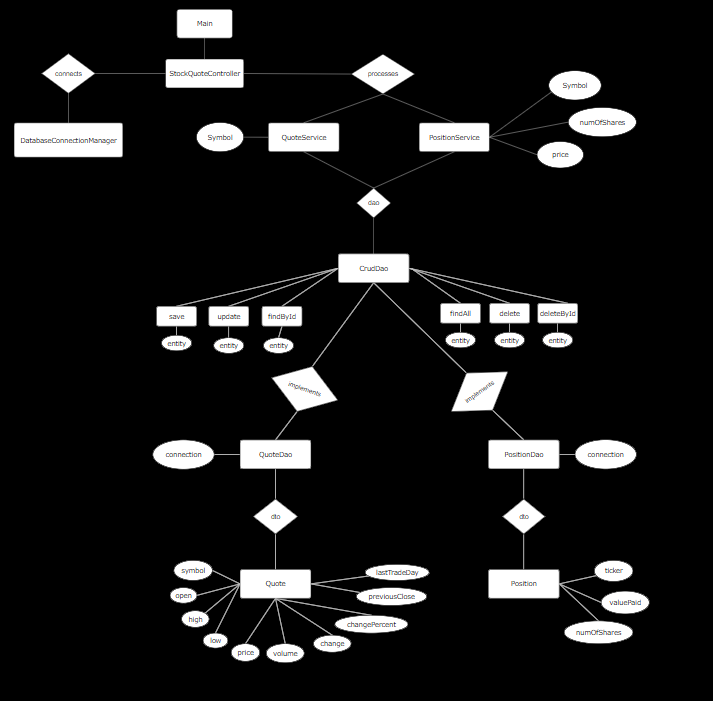

# Introduction
### Usage
The purpose of this project was to create a stock market simulator which allows an individual to view daily updates on particular stocks and buy or sell their shares at market price. It is to help people who want to invest but want to trial run with fake money to start off. Users are asked to enter a request type like view, buy or sell. Users can view all or one of the stocks they have purchased or view stock information of the current market value of a stock. They can also choose to buy new shares of a stock they currently own or a whole new one. With the sell option they can choose to sell their shares of a particular stock or all shares they own. 

### Approach
Java was used to develop this application with Maven as the build tool. Alpha Vantage API from RapidAPI was accessed using a GET request to access real-time stock information. JDBC was used to view/modify data in PostgreSQL. Testing was completed using Junit and Mockito. Docker containerized the application, and GitHub was used for source code management.

# Quick Start
To run the application, follow the below steps:
```bash
# Approach 1: JAR File
cd core_java/jdbc
mvn clean install
java -jar target/learning-jdbc-1.0-SNAPSHOT.jar

# Approach 2: Docker Container
docker_user=tharunii
docker_path=${docker_user}/jdbc
docker pull ${docker_path}

docker compose up
docker run ${docker_path}
```

# Implementation
## ER Diagram


## Design Patterns
### Creational Design Patterns
#### Builder
- The Builder pattern allows you to produce different types and representations of an object using the same construction code.
- PositionDao and QuoteDao implement the CrudDao interface. CrudDao includes the necessary methods like save/update/delete but is implemented differently for Position vs Quote, like the SELECT statements. 

### Structural Design Patterns
#### Facade Pattern
- Facade pattern simplifies the usage of subsystems by providing a higher-level interface and hiding the implementation details.
- The StockQuoteController class in the util package acts as a facade for the application. It provides a simplified interface for interacting with the complex subsystems of the application, such as database operations (DatabaseConnectionManager), HTTP requests (QuoteHTTPHelper), and JSON parsing (JsonParser).

### Miscellaneous Design Patterns
#### Data Access Object (DAO) Pattern
- The DAO pattern separates the data access logic from the business logic, promoting modularity and maintainability.
- The dao package contains PositionDao and QuoteDao classes. These classes are responsible for handling database operations such as CRUD (Create, Read, Update, Delete) operations.

#### Data Transfer Object (DTO) Pattern
- DTOs are simple objects that contain data and have no business logic. They facilitate data exchange and decouple the application's components.
- The dto package contains Quote and Position classes. These classes are used to transfer data between different layers of the application, such as between the DAO and Service layers.


# Test
### Unit and Integration Testing
Junit is used to run unit tests on specific methods and integration tests to ensure all methods are working together as one. Mockito is used to mock certain method calls during unit testing for purposes like reducing the number of API calls being made.

The below command will allow the Junit tests to run:
```bash
mvn test
```

### User Acceptance Testing
Once implementation was complete, manual testing was done my running the application as an end user to test whether the application is behaving as expected. Results were compared with data on the Alpha Vantage API. 
Below are some example inputs done for testing:
```bash
view new MSFT
buy new GOOG
sell AMZN
view old *
```
A log file was created to track the flow of the application, and stores 3 different types of logs: info, warn, error. Info indicates when a specific method call is invoked and if some request is successfully completed. Warn indicates some request failed to process potentially because of an error on the user side, and error tells us when the application crashed for whatever reason. Logger was used to create these logs and is a good way to debug the application.

# Improvement 
1. Improve sell: currently you must sell all shares of a stock. Improve so you can choose a certain amount to sell. Also show the profits made during the sale.
2. Improve GUI: Use Swing in Java to create a more user friendly UI.
3. Fix limitation: Alpha Vantage is Freemium and only allows a certain amount of API calls. Potentially find another source or upgrade plan to fix this.

