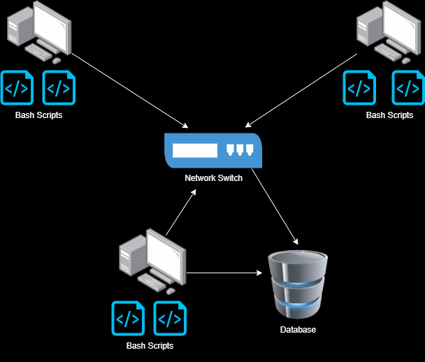

# Introduction
The Jarvis Linux Cluster Administration (LCA) project aims to assist the LCA team in managing a Linux cluster of 10 nodes/servers running CentOS 7. The project utilizes Linux command lines, Bash scripts, PostgreSQL, Docker, and Git to implement a Minimum Viable Product (MVP). Users can write SQL queries to extract real-time resource usage data, facilitating future resource planning. The project includes a `psql` instance for data persistence, a `bash agent` with two scripts (`host_info.sh` and `host_usage.sh`) for data collection, and Docker for database provisioning. The source code is managed on GitHub, and cron is used for scheduling the agent scripts.

# Quick Start
```bash
# Start a psql instance using psql_docker.sh
./scripts/psql_docker.sh

# Create tables using ddl.sql
psql -h localhost -U postgres -d host_agent -f sql/ddl.sql

# Insert hardware specs data into the DB using host_info.sh
./scripts/host_info.sh localhost 5432 host_agent postgres password

# Insert hardware usage data into the DB using host_usage.sh
crontab -e
# Add the following line to run host_usage.sh once per minute
* * * * * /path/to/project/scripts/host_usage.sh localhost 5432 host_agent postgres password > /path/to/project/log/host_usage.log 2>&1
```

# Implementation
## Architecture


## Steps
1. psql_docker.sh: create/start/stop psql docker container 
2. ddl.sql: connects to the host_agent database and creates the host_info and host_usage tables (if not already created)
3. host_info.sh: runs once at installation, collects the host hardware information  (like CPU model number and name) and inserts it into the host_info table
4. host_usage.sh: collects the host usage information (like CPU and Memory) and inserts into the host_usage table
5. crontab: runs the host_usage.sh once every minute

## Scripts
### psql_docker.sh
Starts a Docker container with PostgreSQL.

Usage:
```bash
./scripts/psql_docker.sh
```

### host_info.sh
Collects and inserts host hardware info into the database. It is run only once, at install time.

Usage:
```bash
./scripts/host_info.sh <hostname> <port> <db_name> <username> <password>
```

### host_usage.sh
Collects and inserts current host usage (CPU and Memory) into the database. Triggered by cron at regular intervals.

Usage:
```bash
./scripts/host_usage.sh <hostname> <port> <db_name> <username> <password>
```

### crontab
Crontab setup for running `host_usage.sh` every minute.

```bash
* * * * * /path/to/project/scripts/host_usage.sh localhost 5432 host_agent postgres password > /path/to/project/log/host_usage.log 2>&1
```

### queries.sql
SQL queries to answer business questions.

## Database Modeling
### host_info
| Column       | Type    |
|--------------|---------|
| id           | SERIAL  |
| hostname     | VARCHAR |
| cpu_number   | INT     |
| cpu_arch     | VARCHAR |
| cpu_model    | VARCHAR |
| cpu_mhz      | FLOAT   |
| l2_cache     | INT     |
| total_mem    | INT     |
| timestamp    | TIMESTAMP |

### host_usage
| Column       | Type    |
|--------------|---------|
| id           | SERIAL  |
| timestamp    | TIMESTAMP |
| host_id      | INT     |
| cpu_usage    | FLOAT   |
| free_mem     | INT     |
| total_mem    | INT     |

# Test
Testing was completed on a single machine, but is able to scale to more machines. Bash scripts were tested manually, ensuring the correct outputs were displaying. SQL scripts were tested against sample data. 

# Deployment
The app is deployed using Docker for the PostgreSQL instance, GitHub for source code management, and cron for scheduling agent scripts. 

# Improvements
1. Reduce manual commands to one bash script.
2. Implement a mechanism to handle hardware updates dynamically.
3. Improve analysis by automatically checking the usage difference between machines and flagging a large difference. 
