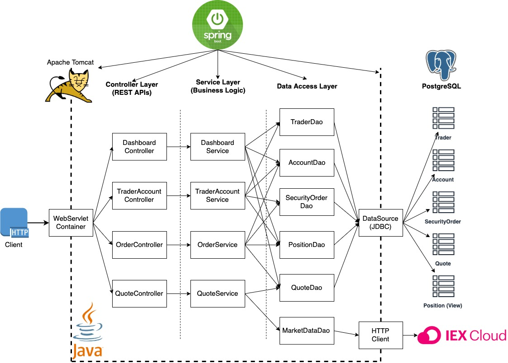

Trading Application Documentation
=================================

Table of Contents
-----------------

-   [Introduction](#Introduction)
-   [Quick Start](#Quick-Start)
-   [Implementation](#Implementation)
    -   [Architecture](#Architecture)
    -   [REST API Usage](#REST-API-Usage)
-   [Test](#Test)
-   [Deployment](#Deployment)
-   [Improvements](#Improvements)

# Introduction
------------

This trading application is designed to manage clients and their accounts, execute security orders, and provide real-time market data. The application leverages various technologies including SpringBoot for application configuration and dependency management, Docker for containerization, PostgreSQL for data persistence, and IEX Cloud for real-time market data.

# Quick Start
-----------

### Prerequisites

-   Docker
-   CentOS 7 or Ubuntu 

### Docker Scripts

To get started quickly with the trading application, you can use the provided Docker scripts. Below are the instructions to build images, create a Docker network, and start containers.

1.  Build Docker Images

    `docker build -t trading-app .`

2.  Create a Docker Network

    `docker network create trading-net`

3.  Start Containers

    `docker run -d --name trading-db --network trading-net -e POSTGRES_PASSWORD=password -e POSTGRES_DB=trading -v trading-data:/var/lib/postgresql/data postgres:alpine
    docker run -d --name trading-app --network trading-net -p 8080:8080 trading-app`

### Try Trading-App with SwaggerUI

Once the application is running, you can interact with the API using SwaggerUI available at `http://localhost:8080/swagger-ui.html`.

Implementation
--------------

### Architecture

The architecture of the trading application includes several key components and services. Below is a component diagram representing the architecture:

#### Controller Layer

The Controller layer handles incoming HTTP requests, processes them, and returns appropriate responses. It acts as an interface between the client and the service layer.

#### Service Layer

The Service layer contains business logic and handles the core functionality of the application. It processes data from the DAO layer and provides results to the controller layer.

#### DAO Layer

The DAO (Data Access Object) layer manages interactions with the database. It provides an abstraction for performing CRUD operations on the database entities.

#### SpringBoot

SpringBoot simplifies the setup and configuration of the application. It includes an embedded web server (Tomcat) and manages the IoC (Inversion of Control) container, which handles dependency injection.

#### PSQL and IEX

PostgreSQL (PSQL) is used for data persistence, storing information about accounts, quotes, positions, and orders. IEX Cloud provides real-time market data, which is fetched and cached by the application.

### REST API Usage

#### Swagger

Swagger is an open-source tool used for documenting RESTful APIs. It provides a user-friendly UI to interact with the API endpoints, making it easier for developers and testers to understand and use the API.

#### Quote Controller

The Quote Controller manages market data related to securities. It fetches data from IEX and caches it in the PostgreSQL database.

-   GET `/quote/dailyList`: Lists all securities available for trading in the system.
-   GET `/quote/{ticker}`: Retrieves the quote for a specific ticker.
-   POST `/quote/`: Adds a new quote to the system.

#### Trader Controller

The Trader Controller handles operations related to traders and their accounts. It supports creating traders, managing accounts, and performing fund transactions.

-   POST `/trader/`: Creates a new trader and associated account.
-   DELETE `/trader/{id}`: Deletes a trader and associated account.
-   PUT `/account/deposit`: Deposits funds into a specified account.
-   PUT `/account/withdraw`: Withdraws funds from a specified account.

#### Order Controller

The Order Controller manages the execution of market orders for buying and selling securities.

-   POST `/order/marketOrder`: Executes a market order to buy or sell securities.

#### App Controller

The App Controller provides endpoints for general application operations.

-   GET `/app/status`: Returns the status of the application.
-   GET `/app/health`: Returns the health status of the application.

# Test
----

The application includes comprehensive tests to ensure functionality and reliability. The tests are written using JUnit and Mockito, providing high code coverage for all major components. The test classes are located in the `src/test/java/ca/jrvs/apps/trading` directory.  
Once implementation was complete, manual testing was done my running the application as an end user to test whether the application is behaving as expected. Logger was used to create a log file which tracked the flow of the application, and stores 3 different types of logs: info, warn, error which tells us what stage and status the application is at.

# Deployment
----------

The application is containerized using Docker, enabling easy deployment and scalability. Below is a Docker diagram illustrating the setup:

### Docker Images

-   trading-app: Contains the application code and dependencies.
-   trading-db: PostgreSQL database initialized with required tables and data.

# Improvements
------------

If given more time, the following improvements could be made:

1. Individuality: have a login feature so it allows multiple user handling on one system.
2.  Improved Error Handling: Create a more robust error handling mechanism to provide clearer feedback to users.
3.  Scalability: Improve to make application usable for larger user base that has real time data and fast user updates.
